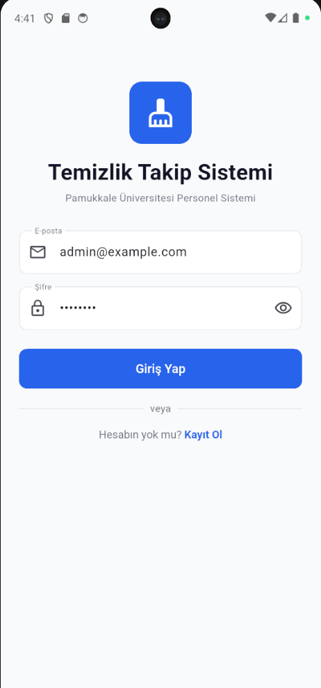
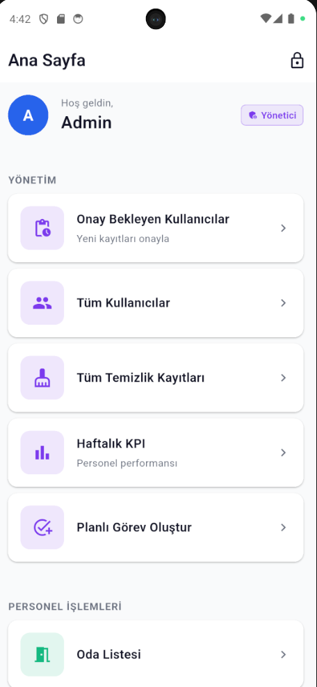
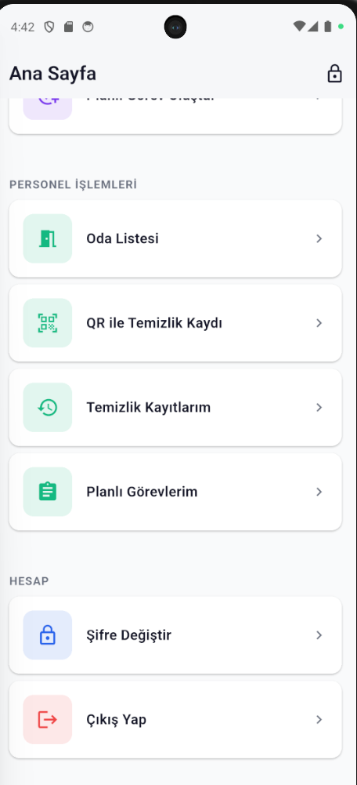
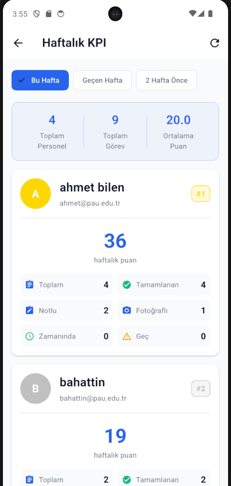
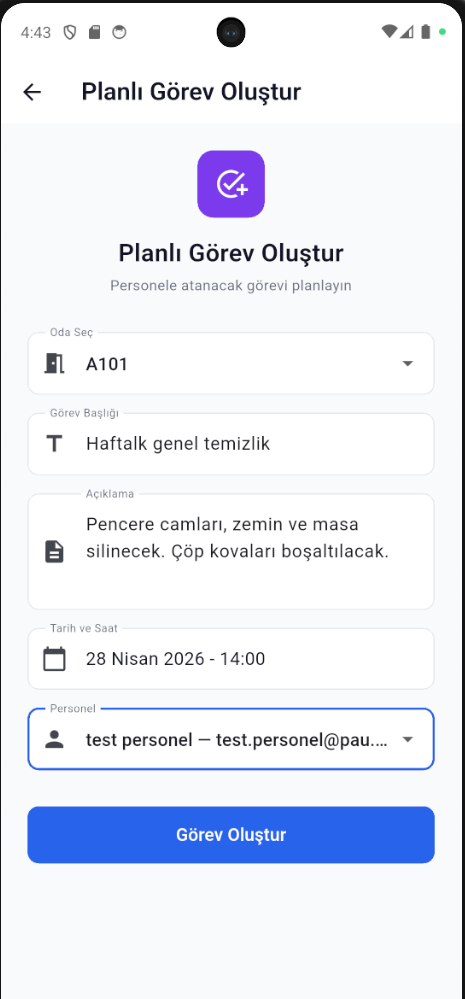

# 🧹 Temizlik Takip Sistemi

### Cleaning Management System for University Personnel

Pamukkale Üniversitesi kampüs temizlik personelinin günlük temizlik görevlerini kayıt altına aldığı, yöneticilerin haftalık performans verilerini takip edebildiği fullstack mobil uygulamadır.

---

## 📱 Demo

<table>
  <tr>
    <td align="center"><b>Giriş</b></td>
    <td align="center"><b>Yönetim Paneli</b></td>
    <td align="center"><b>Personel Paneli</b></td>
  </tr>
  <tr>
    <td></td>
    <td></td>
    <td></td>
  </tr>
  <tr>
    <td align="center"><b>Haftalık KPI</b></td>
    <td align="center"><b>Planlı Görev</b></td>
    <td></td>
  </tr>
  <tr>
    <td></td>
    <td></td>
    <td></td>
  </tr>
</table>

---

## 🎯 Vizyon

Üniversite kampüslerinde temizlik personeli takibi genellikle kâğıt çizelgelerle veya WhatsApp grupları üzerinden yapılır — şeffaf değildir, ölçülemez, adil değildir. Bu proje, **QR kod ile lokasyon doğrulamalı temizlik kaydı** ve **haftalık KPI skorlamasıyla** bu süreci dijitalleştirir.

---

## ✨ Özellikler

### Personel İçin

- 📷 QR kod ile temizlik kaydı (not + fotoğraf opsiyonel)
- 📋 Planlı görev takibi
- 📊 Geçmiş kayıtları gözden geçir

### Yönetici İçin

- ✅ Kullanıcı onay sistemi
- 📅 Görev planlama (oda + personel + tarih/saat)
- 🏆 Haftalık KPI sıralaması (madalya pozisyonlu)
- 👥 Personel detay incelemesi

### Sistem

- 🔐 JWT authentication (8 saat)
- 🛡️ Role-based access control
- 🌐 @pau.edu.tr domain kısıtı
- 🔒 bcrypt şifreleme (NIST uyumlu)
- 🇹🇷 Tam Türkçe arayüz

---

## 📐 KPI Formülü
